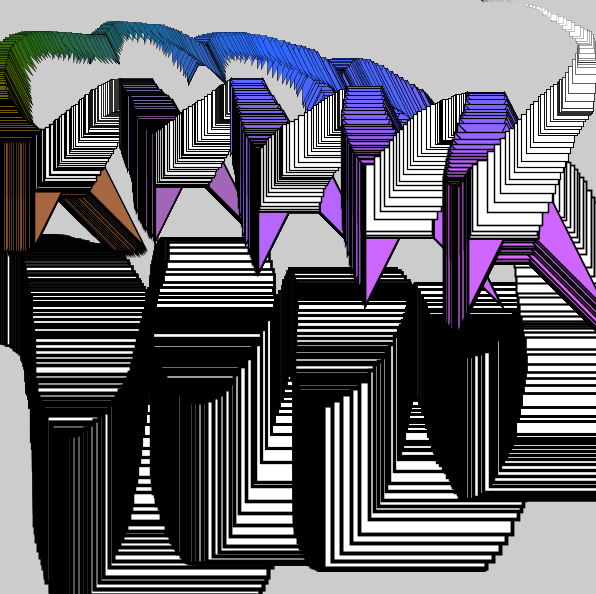
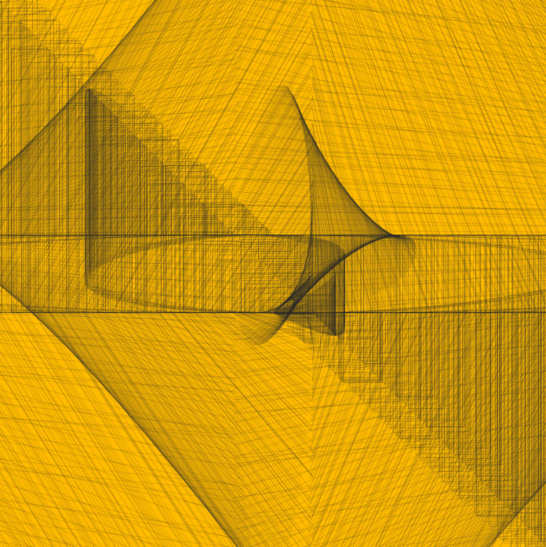

# processingD-18-19
_code like a designer_

## cyclop dog

my first encounter with processing using the most basic basics.

      
      
      
## shady shapes

the result of my first try doing something interactive

the size and color of the shape changes by moving the mouse. if you press the mouse you get a diffrent shape.

## pong 

a very classic two-player-version of pong.

  

The player can move his rectangle with the commands UP and DOWN as long as the ball is moving in his direction.

## curves

my first effort experimenting with sin and cos

 
